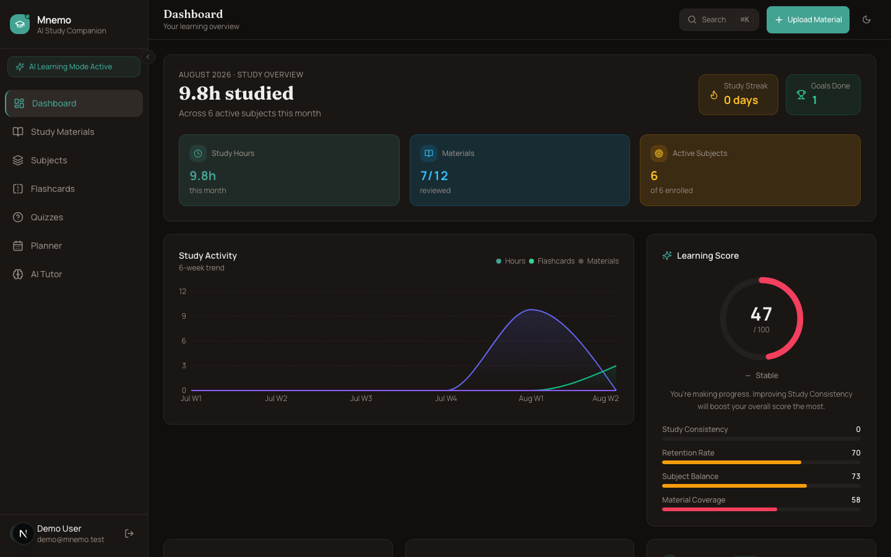
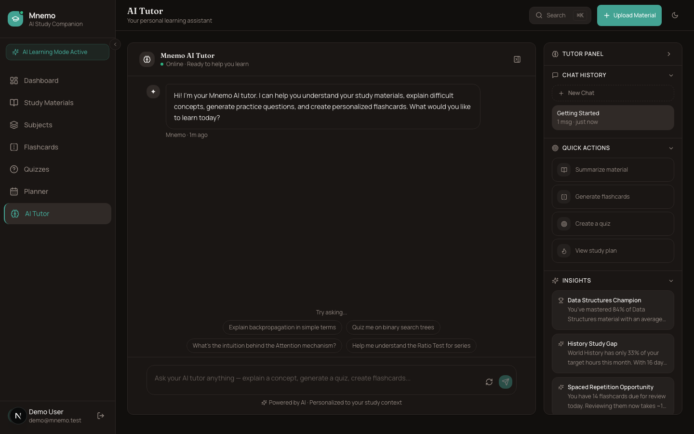
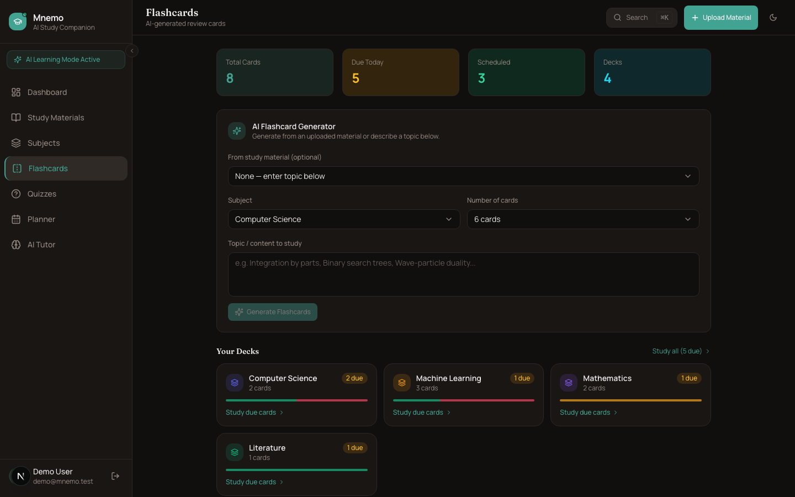
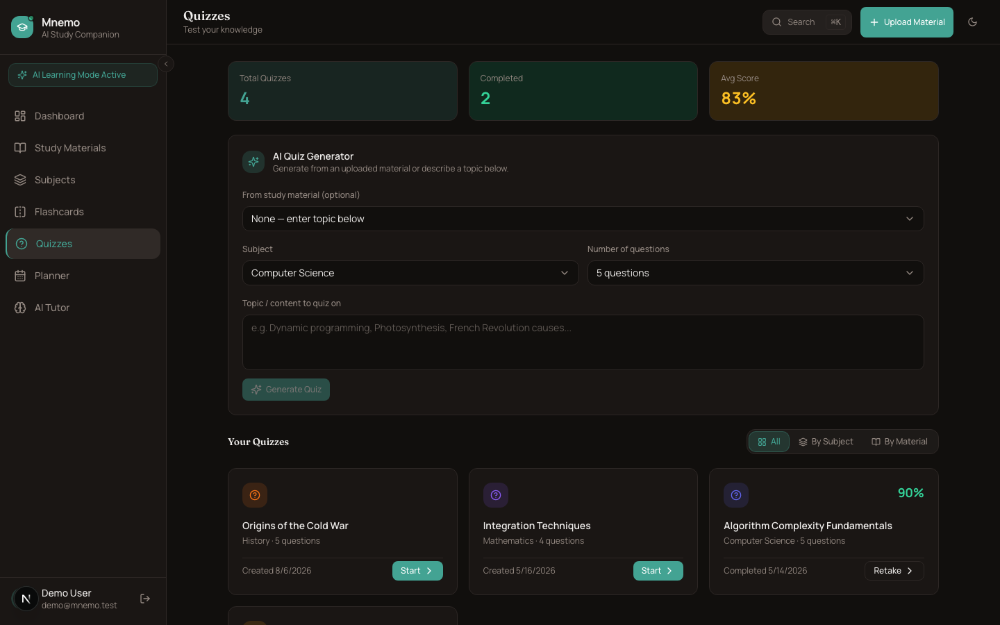
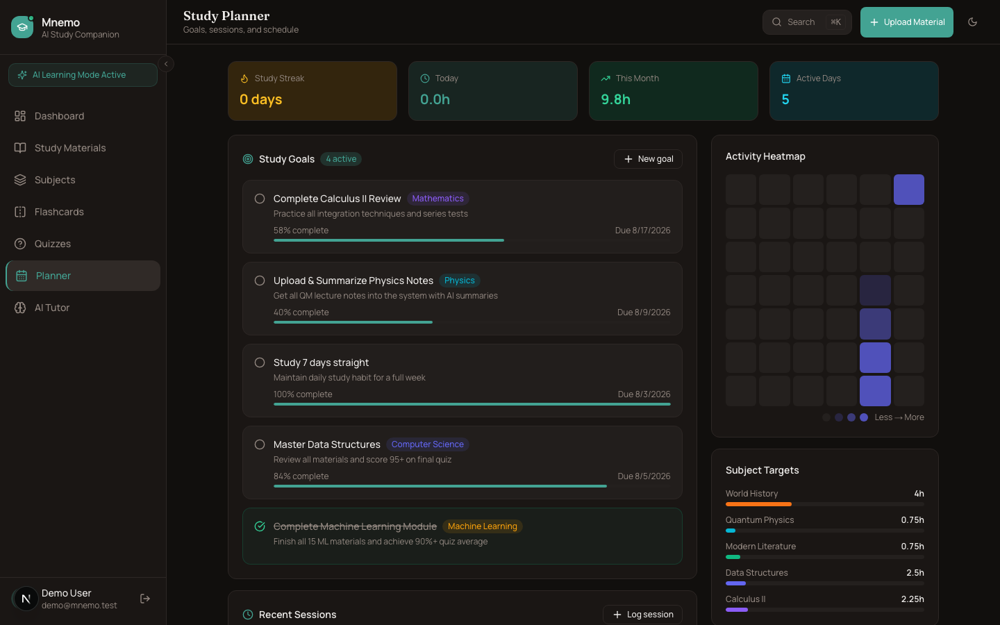

<div align="center">

# Mnemo

**AI-powered study companion** — summarize materials, generate flashcards and quizzes, and chat with an AI tutor that stays grounded in your own content.

[](https://mnemo-omega.vercel.app)
[](https://nextjs.org)
[](https://www.typescriptlang.org)
[](https://supabase.com)
[](LICENSE)

[**Try the live demo →**](https://mnemo-omega.vercel.app)

</div>

<br>



## What it does

Mnemo takes whatever you're studying — lecture notes, textbook chapters, pasted text — and turns it into a working study system:

- **AI Tutor** — a chat assistant that explains concepts, answers questions, and remembers conversation history across sessions
- **Document summarization** — upload a `.txt`/`.docx` file or paste text; AI extracts a summary and key points on demand
- **Smart flashcards** — generate flashcards from any topic or an uploaded material, with a 3D-flip review UI and per-card difficulty
- **Quiz generator** — AI-authored multiple-choice quizzes with instant scoring and per-question explanations
- **Study planner** — goals, session logging, streaks, and a GitHub-style activity heatmap computed from real study sessions
- **Live dashboard** — study hours, subject breakdown, and a "learning score" all computed from actual usage, not canned numbers

Everything above is generated by AI; every number on screen is computed by plain TypeScript from real data. The two are never mixed — see [Architecture](#architecture) below.

## Screenshots

<table>
<tr>
<td width="50%"></td>
<td width="50%"></td>
</tr>
<tr>
<td width="50%"></td>
<td width="50%"></td>
</tr>
</table>

## Try it

The [live demo](https://mnemo-omega.vercel.app) runs against a real Supabase project. Sign in with the seeded demo account (one click on the login page) to see a populated dashboard, or sign up fresh to start from zero.

| Account | Email | Password |
|---|---|---|
| Demo (seeded data) | `demo@mnemo.test` | `demo123456` |
| Test (empty) | `test@mnemo.test` | `test123456` |

## Architecture

**Mock-first, zero config.** Clone the repo and run it with no environment variables — every data service checks for real credentials before touching a network, and falls back to realistic in-memory mock data otherwise. Add Supabase and OpenRouter keys and the exact same UI switches to a live backend. No code branches, no separate "demo mode."

**AI explains, math computes.** AI models never calculate a statistic — study hours, streaks, scores, and progress percentages are all derived by plain functions in `utils/analytics.ts` from real stored data. AI is used only for the things a language model is actually good at: summarizing, explaining, and generating questions.

**One route per AI capability.** Each AI feature (tutor chat, summarization, flashcard generation, quiz generation) is its own agent module and its own API route — no monolithic "do everything" endpoint. Requests fail over automatically: primary model → OpenRouter's free model router → Groq, so a single provider outage doesn't take down the app.

```
app/                  Next.js App Router — pages, layouts, API routes
components/           UI components (flat, token-based design system, Radix primitives)
services/ai/          AI agents + provider abstraction (OpenRouter / Groq)
services/supabase/    Supabase client + typed repository layer
store/                Zustand stores (one per domain: auth, materials, flashcards, quizzes, sessions, AI chat, UI)
utils/analytics.ts    All derived study statistics — the only place numbers get computed
types/                Shared type definitions
```

## Tech stack

| Layer | Choice |
|---|---|
| Framework | Next.js 15 (App Router, Turbopack) + React 19 |
| Language | TypeScript, strict mode |
| State | Zustand |
| Styling | Tailwind CSS + a flat, token-based design system (Radix primitives) |
| Data | Supabase (Postgres + Auth + Storage), mock-first fallback |
| AI | OpenRouter (free model router) with automatic Groq failover |
| Charts | Recharts |
| Deployment | Vercel |

## Running locally

```bash
git clone https://github.com/lumen202/mnemo.git
cd mnemo
npm install
npm run dev
```

The app runs immediately with mock data — no `.env.local` required. To connect a real backend, copy `.env.local.example` to `.env.local` and fill in Supabase + OpenRouter credentials, then optionally run `npm run seed` to populate demo accounts.

## License

MIT
